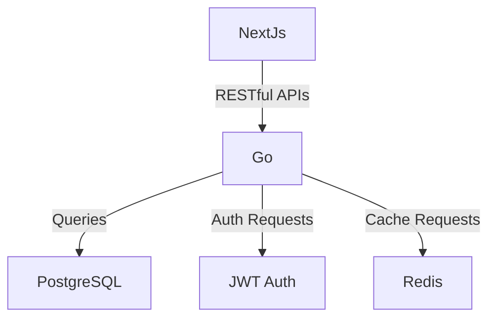

# E-commerce Application Architecture

## Overview

This document provides an overview of the architecture for the e-commerce application. The architecture is designed to be scalable, maintainable, and secure.

## Components

### 1. Frontend

- **Technology**: NextJs
- **Description**: The frontend is responsible for the user interface and user experience. It communicates with the backend via RESTful APIs.

### 2. Backend

- **Technology**: Go (formerly Golang)
- **Description**: The backend handles business logic, data processing, and communication with the database. It exposes RESTful APIs for the frontend to consume.

### 3. Database

- **Technology**: PostgreSQL
- **Description**: The database stores all the application data, including user information, product details, orders, and transactions.

### 4. Authentication Service

- **Technology**: Custom built JWT auth.
- **Description**: This handles role based user authentication and authorization, ensuring secure access to the application.

### 5. Payment Gateway

- **Technology**: Stripe API
- **Description**: The payment gateway processes payments securely and integrates with various payment methods.

### 6. Caching Layer

- **Technology**: Redis
- **Description**: The caching layer improves application performance by storing frequently accessed data in memory.

## Architecture Diagram

## Deployment

- **Containerization**: Docker
- **Orchestration**: Kubernetes
- **CI/CD**: GitHub Actions

## Security

- **Encryption**: TLS/SSL for data in transit, AES for data at rest

## Conclusion
This architecture ensures that the e-commerce application is robust, scalable, and secure, providing a seamless experience for users.
